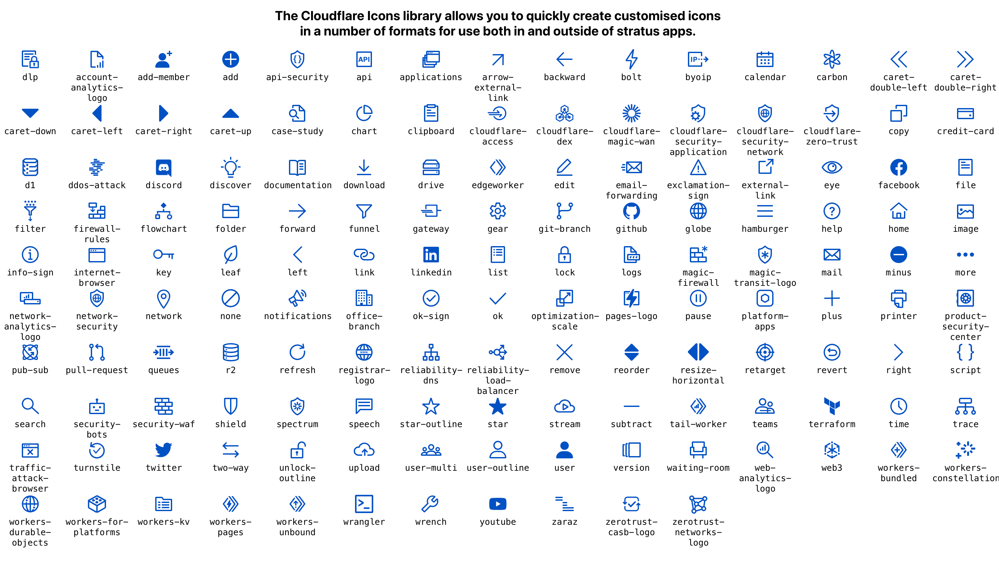

Cloudflare Icons 
https://cf-icons.pages.dev/ for your architecture diagram,
<br/>
which is pulled from this npm public module [@cloudflare/component-icon](https://www.npmjs.com/package/@cloudflare/component-icon)



To deploy on Cloudflare Pages, use the following env parameter

```shell
CI = false
YARN_VERSION = 1
ACCOUNT_HASH = YOUR_ACCOUNT_HASH
```

To reflect the latect icons data, use the following command

```shell:
cd cf-icons

npm i @cloudflare/component-icon
mkdir -p src/components/reactsvgs
cp node_modules/@cloudflare/component-icon/es/reactsvgs/* src/components/reactsvgs/
```

To upload SVG into Cloudflare Images for external URL reference

```
# cd TO_SVG_FILES_DIR
ls -1 | while read line
do
  curl -vvv --request POST \
    https://api.cloudflare.com/client/v4/accounts/$ACCOUNT_ID/images/v1 \
    -H "X-Auth-Email: $EMAIL" \
    -H "X-Auth-Key: $APIKEY" \
    --form 'file=@./'$line'' \
    --form 'id='$(basename $line .svg)''
done
```

Another great icon library is also here

- [Brand Icons - Cloudflare Datamining](https://cfdata.lol/icons/)